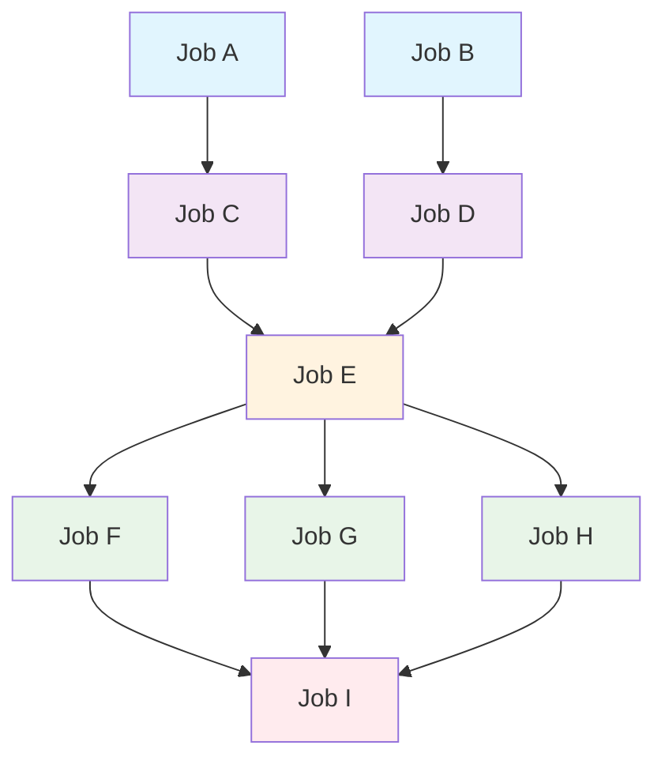

# Parallel Job Scheduler With Dependent Jobs

## Problem Statement

Write java program for Parallel Job Scheduler. Implement the generic solution in Java using Multithreading, given a list of jobs and its children jobs.

For example:

- Job A and Job B are the starting jobs which can be started in parallel
- Job C is a child of Job A and Job D is a child of Job B. So, Job C needs to wait until Job A completes and Job D needs to wait till Job B completes
- Job E is a child of both Job C and Job D. Therefore, it needs to wait until both Job C and Job D completes.
- Job F, Job G and Job H are the children of Job E. So, as soon as Job E completes, all three of the children jobs can be started in parallel.
- Finally, Job I is the child of all three jobs Job F, Job G and Job H. So, Job I needs to wait till Job F, Job G and Job H to complete.

## Job Dependency Flow

The following Mermaid diagram shows the flow of the example described above:



**Execution Levels:**

- **Level 0**: Job A, Job B (can run in parallel)
- **Level 1**: Job C, Job D (wait for Level 0)
- **Level 2**: Job E (waits for both Job C and Job D)
- **Level 3**: Job F, Job G, Job H (can run in parallel after Job E)
- **Level 4**: Job I (waits for Job F, Job G, and Job H)

## Solution

This repository provides a robust implementation of a parallel job scheduler that can schedule dependent jobs efficiently. The scheduler uses a configurable thread pool to execute jobs and ensures that child jobs are not executed before their parent jobs are completed.

## Getting Started

### Basic Usage

To use this scheduler, you need to define the jobs and their dependencies in the form of a directed acyclic graph (DAG). Each job is represented by an instance of the Job class and can have zero or more parent jobs.

**Create a simple job with no dependencies:**

```java
Job jobA = new Job("Job A");
```

**Create a job with dependencies:**

```java
Job jobB = new Job("Job B", jobA); // jobB depends on jobA
```

**Create a job with multiple dependencies:**

```java
Job jobE = new Job("Job E", jobC, jobD); // jobE depends on both jobC and jobD
```

### Complete Example

```java
import models.Job;
import scheduler.ParallelJobScheduler;
import java.util.Arrays;
import java.util.List;

public class Example {
    public static void main(String[] args) {
        // Create all jobs with their dependencies
        Job jobA = new Job("Job A");
        Job jobB = new Job("Job B");
        Job jobC = new Job("Job C", jobA);
        Job jobD = new Job("Job D", jobB);
        Job jobE = new Job("Job E", jobC, jobD);
        Job jobF = new Job("Job F", jobE);
        Job jobG = new Job("Job G", jobE);
        Job jobH = new Job("Job H", jobE);
        Job jobI = new Job("Job I", jobF, jobG, jobH);

        // Create scheduler with custom thread pool size
        ParallelJobScheduler scheduler = new ParallelJobScheduler(4);

        // Schedule starting jobs (jobs with no dependencies)
        List<Job> startingJobs = Arrays.asList(jobA, jobB);
        scheduler.scheduleAllJobs(startingJobs);
    }
}
```

### Advanced Configuration

**Custom thread pool size:**

```java
ParallelJobScheduler scheduler = new ParallelJobScheduler(8); // 8 worker threads
```

**For testing with dependency injection:**

```java
Consumer<String> logger = System.out::println;
Random random = new Random(42); // deterministic for testing
Job job = new Job("Test Job", logger, random, parentJob1, parentJob2);
job.setSleepTimeMs(100); // fixed execution time for testing
```

## Project Structure

```
src/
├── main/java/                         # Source code (standard Maven/Gradle layout)
│   ├── Main.java                      # Example application
│   ├── models/
│   │   └── Job.java                   # Job class with execution logic
│   └── scheduler/
│       └── ParallelJobScheduler.java  # Main scheduler implementation
└── test/java/                         # Test code (standard Maven/Gradle layout)
    ├── models/
    │   └── JobTest.java               # Unit tests for Job class
    ├── scheduler/
    │   └── ParallelJobSchedulerTest.java # Unit tests for scheduler
    ├── IntegrationTest.java           # End-to-end integration tests
    └── TestRunner.java                # Simple test runner

build.gradle                          # Gradle build configuration
TESTING.md                            # Comprehensive testing documentation
```

## Running the Application

### Run the Example

**Using Gradle (Recommended):**
```bash
./gradlew runMain
```

**Manual compilation:**
```bash
javac -d build -cp src/main/java src/main/java/**/*.java
java -cp build Main
```

### Run Tests

**Using Gradle (Recommended):**
```bash
./gradlew test
```

**Using Simple Test Runner:**
```bash
javac -d build -cp src/main/java src/main/java/**/*.java src/test/java/TestRunner.java
java -cp build TestRunner
```

**Manual compilation with JUnit:**
```bash
javac -d build -cp "src/main/java:junit-platform-console-standalone.jar" src/main/java/**/*.java src/test/java/**/*.java
# Run with JUnit Platform Console Launcher
```

## Testing

This project includes comprehensive testing:

- **Unit Tests**: 15+ tests covering individual components
- **Integration Tests**: End-to-end workflow validation
- **Performance Tests**: Parallel execution efficiency verification
- **Thread Safety Tests**: Concurrent access validation
- **Edge Case Tests**: Empty inputs, cycles, single jobs

See [TESTING.md](TESTING.md) for detailed testing documentation.

## Architecture

### Core Components

1. **Job Class**: Represents a unit of work with dependencies

   - Implements `Runnable` for thread execution
   - Uses `CountDownLatch` for dependency coordination
   - Thread-safe children list management

2. **ParallelJobScheduler**: Orchestrates job execution

   - Builds execution order from dependency graph
   - Manages thread pool lifecycle
   - Detects and prevents cycles

3. **Dependency Management**:
   - Parent-child relationships using collections
   - CountDownLatch for synchronization
   - BFS traversal for execution ordering

### Execution Flow

1. **Validation**: Check for cycles in dependency graph
2. **Planning**: Build execution order using BFS traversal
3. **Submission**: Submit all jobs to thread pool
4. **Coordination**: Jobs wait for dependencies using CountDownLatch
5. **Execution**: Jobs run work and signal completion to children
6. **Cleanup**: Proper thread pool shutdown with timeout

## Performance Characteristics

- **Parallel Efficiency**: Jobs execute concurrently when dependencies allow
- **Resource Management**: Configurable thread pool prevents resource exhaustion
- **Scalability**: Handles large dependency graphs efficiently
- **Memory Usage**: Minimal overhead with lazy evaluation

**Example timing for the README workflow:**

- Sequential execution: ~36 seconds (9 jobs × 4s each)
- Parallel execution: ~16 seconds (4 dependency levels × 4s each)

## Configuration Options

| Parameter        | Default     | Description                      |
| ---------------- | ----------- | -------------------------------- |
| Thread Pool Size | 4           | Number of worker threads         |
| Shutdown Timeout | 60s         | Max wait time for job completion |
| Job Sleep Time   | Random 4-8s | Simulated work duration          |

## Error Handling

- **Cycle Detection**: Throws `IllegalArgumentException` for circular dependencies
- **Thread Interruption**: Graceful handling with status preservation
- **Timeout Handling**: Forced shutdown if jobs don't complete in time
- **Resource Cleanup**: Guaranteed ExecutorService shutdown

## Limitations and Considerations

- **DAG Requirement**: Dependencies must form a Directed Acyclic Graph
- **Memory Usage**: Large graphs may consume significant memory
- **Thread Safety**: Job implementations must be thread-safe
- **Blocking Operations**: Jobs should handle interruption properly
